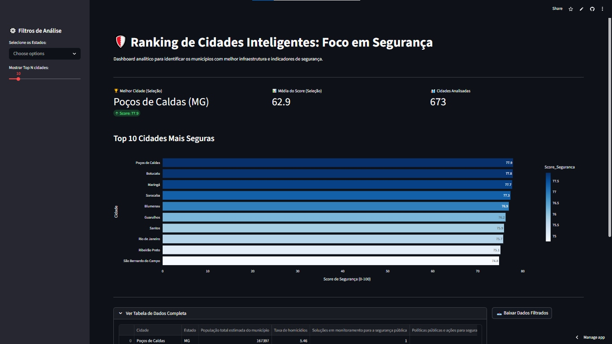

# 🛡️ Dashboard de Cidades Seguras

Dashboard analítico interativo para identificar e ranquear os municípios brasileiros com melhor infraestrutura e indicadores de segurança, desenvolvido com **Streamlit** e **Plotly**.

[](https://dashboard-cidades-seguras-projetointegrador.streamlit.app/)

> 🔗 **Acesse o app ao vivo:** [dashboard-cidades-seguras-projetointegrador.streamlit.app](https://dashboard-cidades-seguras-projetointegrador.streamlit.app/)



---

## 👥 Autores

| Nome | GitHub |
|------|--------|
| Alex Mendes | [@alex3ai](https://github.com/alex3ai) |
| Nathalia Lemes das Virgens | [@Nathalia1Lemes](https://github.com/Nathalia1Lemes)|

## 📋 Sobre o Projeto

Este projeto utiliza dados do programa **Cidades Inteligentes (DESSUST)** para construir um pipeline de ETL e um dashboard visual que permite explorar e comparar municípios brasileiros com base em um **Score de Segurança** calculado a partir de múltiplos indicadores urbanos.

O objetivo é transformar dados brutos em inteligência acessível, possibilitando análises filtradas por estado e visualização dos rankings das cidades mais seguras do Brasil.

## 🚀 Funcionalidades

- 🏆 **KPIs em tempo real** — melhor cidade, média do score e total de cidades analisadas
- 📊 **Gráfico de barras horizontal interativo** com ranking das Top N cidades
- 🔎 **Filtros dinâmicos** por estado e por quantidade de cidades (Top 5 a Top 50)
- 📥 **Exportação de dados filtrados** em formato CSV
- 🗃️ **Tabela expandível** com os dados completos da seleção
- ⚡ **Cache de dados** para carregamento otimizado

## 🗂️ Estrutura do Projeto

```
dashboard-cidades-seguras/
├── app.py                          # Aplicação principal Streamlit
├── ETL.ipynb                       # Notebook de extração, transformação e carga dos dados
├── Cidade Inteligente(DESSUST).csv # Dataset bruto do programa Cidades Inteligentes
├── ranking_seguranca_cidades.csv   # Dataset tratado com o Score de Segurança calculado
├── requirements.txt                # Dependências do projeto
└── .gitignore
```

## 🛠️ Tecnologias Utilizadas

| Tecnologia | Finalidade |
|------------|------------|
| [Python 3](https://www.python.org/) | Linguagem principal |
| [Streamlit](https://streamlit.io/) | Framework do dashboard web |
| [Plotly Express](https://plotly.com/python/plotly-express/) | Visualizações interativas |
| [Pandas](https://pandas.pydata.org/) | Manipulação e análise de dados |
| Jupyter Notebook | Pipeline de ETL |

## ⚙️ Como Executar Localmente

**Pré-requisitos:** Python 3.8+

1. **Clone o repositório:**
   ```bash
   git clone https://github.com/alex3ai/dashboard-cidades-seguras.git
   cd dashboard-cidades-seguras
   ```

2. **Crie e ative um ambiente virtual (recomendado):**
   ```bash
   python -m venv .venv
   source .venv/bin/activate  # Linux/macOS
   .venv\Scripts\activate     # Windows
   ```

3. **Instale as dependências:**
   ```bash
   pip install -r requirements.txt
   ```

4. **Execute o pipeline de ETL** (caso queira regenerar os dados tratados):
   - Abra e execute o notebook `ETL.ipynb` no Jupyter

5. **Inicie o dashboard:**
   ```bash
   streamlit run app.py
   ```

6. Acesse no navegador: `http://localhost:8501`

## 📊 Fonte dos Dados

Os dados utilizados são provenientes do programa **DESSUST – Cidades Inteligentes**, iniciativa governamental para mapeamento de indicadores de inteligência e infraestrutura urbana dos municípios brasileiros.

## 📄 Licença

Este projeto está disponível para fins educacionais e acadêmicos.
